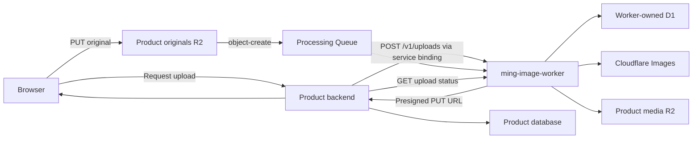
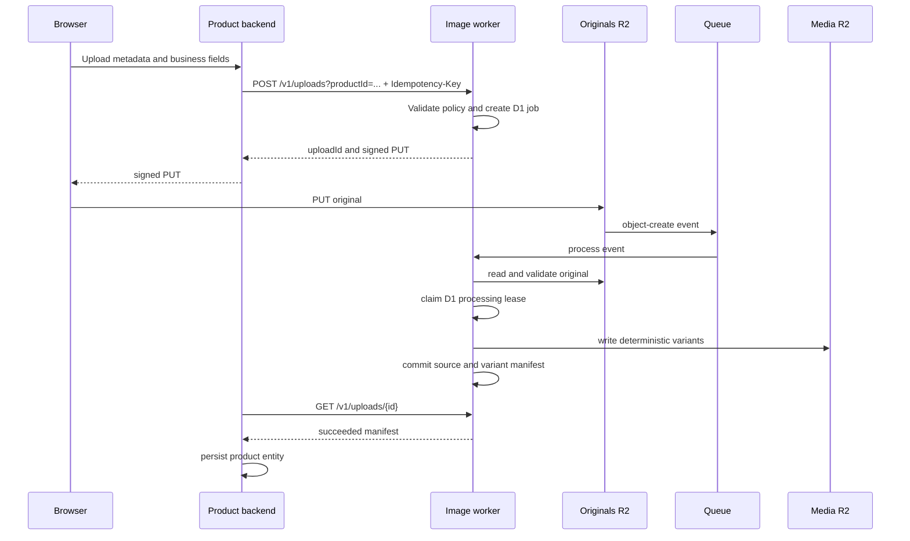

# ming-image-worker

Private multi-product image upload and optimization service for Cloudflare Workers.

The Worker is called only by trusted backends through same-account Cloudflare service bindings.
It creates presigned R2 uploads, tracks processing in its own D1 database, receives R2
`object-create` events through Cloudflare Queues, transforms images with Cloudflare Images, and
returns a stable output manifest for the product backend to persist in its own domain.

```text
Browser -> Product backend -> service binding -> ming-image-worker -> presigned R2 PUT
Browser -> R2 originals bucket -> object-create event -> Queue
Queue -> ming-image-worker -> Cloudflare Images -> output R2
Product backend -> service binding polling -> product database
```

This is not a public image API. `workers_dev` is disabled, no public route or browser CORS
middleware is configured, and only the signed R2 PUT URL is browser-facing.

## Responsibility boundaries

The image worker owns:

- upload negotiation and idempotency;
- closed product, preset, and storage policy;
- presigned R2 PUT URLs;
- image processing state and leases in its own D1 database;
- R2 event, Queue retry, and dead-letter processing;
- Cloudflare Images transformations;
- variant storage and output manifests;
- optional original cleanup.

Each product backend owns:

- browser authentication and authorization;
- CORS, rate limiting, abuse controls, and business validation;
- domain metadata such as sessions, alt text, captions, ordering, or camera data;
- polling and product-facing upload status;
- persistence into product tables after processing succeeds.

All Workers with a service binding are trusted in v1. They can select any configured `productId`.
Do not grant the binding to an untrusted Worker. If consumers later require isolation inside one
Cloudflare account, introduce named entrypoints or consumer credentials before onboarding them.

## Architecture





## Technology

- Bun for package management and project scripts.
- Hono and `@hono/zod-openapi` for the private HTTP contract.
- Zod for request, runtime, and product-policy validation.
- D1 and Drizzle schema definitions for job persistence.
- R2 and `aws4fetch` for direct presigned uploads.
- Cloudflare Images bindings for transformations.
- Cloudflare Queues and a DLQ for asynchronous processing.
- Wrangler-generated Worker runtime types.

## Project structure

```text
src/
├── app/                    # Hono bootstrap, OpenAPI, and route registration
├── config/                 # Runtime parsing, image policy, and handlers
├── db/
│   ├── migrations/         # Worker-owned D1 migrations
│   └── schema/             # Drizzle schema
├── modules/
│   ├── images/             # Cloudflare Images adapter
│   ├── processing/         # Queue, leases, retries, transforms, retention
│   ├── storage/            # R2 registry, keys, URLs, signing
│   └── uploads/            # Private HTTP contract and job repository
├── shared/                 # Stable errors and HTTP/OpenAPI helpers
└── index.ts                # Fetch and Queue handlers
```

## Private HTTP contract

Consumers call an arbitrary internal URL through `serviceBinding.fetch`; the hostname is not used
for routing:

```ts
const response = await env.IMAGE_WORKER.fetch(
  "https://image-worker.internal/v1/uploads?productId=roncalphoto",
  request,
);
```

Every successful response uses:

```json
{
  "success": true,
  "data": {}
}
```

Every failed response uses:

```json
{
  "success": false,
  "error": {
    "code": "STABLE_ERROR_CODE",
    "message": "Safe message",
    "retryable": false
  }
}
```

### Create an upload

```text
POST /v1/uploads?productId=<product-id>
Idempotency-Key: <8-160 character key>
Content-Type: application/json
```

```json
{
  "presetId": "roncalphoto-portfolio",
  "externalId": "optional-product-reference",
  "filename": "portrait.jpg",
  "contentType": "image/jpeg",
  "sizeBytes": 4213371,
  "metadata": {
    "requestId": "request-123",
    "source": "photos-admin"
  }
}
```

```json
{
  "success": true,
  "data": {
    "uploadId": "c45de47d-53a3-4df1-a2b0-928879bbc334",
    "status": "awaiting_upload",
    "upload": {
      "url": "https://<account>.r2.cloudflarestorage.com/...",
      "expiresAt": "2026-06-12T12:15:00.000Z",
      "headers": {
        "Content-Type": "image/jpeg"
      }
    }
  }
}
```

The same `productId` and `Idempotency-Key` with the same request returns the existing job. While
the job is `awaiting_upload`, a fresh signed URL is returned. Reusing the key with different input
returns `IDEMPOTENCY_CONFLICT`. Once processing has started, `upload` is `null` to prevent an
original from being overwritten.

### Get upload status

```text
GET /v1/uploads/{uploadId}?productId=<product-id>
```

Status is one of:

- `awaiting_upload`
- `queued`
- `processing`
- `succeeded`
- `failed`

Successful processing returns:

```json
{
  "success": true,
  "data": {
    "uploadId": "c45de47d-53a3-4df1-a2b0-928879bbc334",
    "productId": "roncalphoto",
    "presetId": "roncalphoto-portfolio",
    "externalId": "photo-reservation-id",
    "status": "succeeded",
    "attempts": 1,
    "originalRetentionStatus": "retained",
    "manifest": {
      "source": {
        "contentType": "image/jpeg",
        "width": 6000,
        "height": 4000,
        "sizeBytes": 4213371
      },
      "variants": {
        "main": {
          "name": "main",
          "bucket": "roncalphoto-media",
          "key": "products/roncalphoto/uploads/.../main.webp",
          "publicUrl": null,
          "contentType": "image/webp",
          "width": 1920,
          "height": 1280,
          "sizeBytes": 318224
        },
        "thumbnail": {
          "name": "thumbnail",
          "bucket": "roncalphoto-media",
          "key": "products/roncalphoto/uploads/.../thumbnail.webp",
          "publicUrl": null,
          "contentType": "image/webp",
          "width": 480,
          "height": 320,
          "sizeBytes": 38210
        }
      }
    },
    "error": null,
    "createdAt": "2026-06-12T12:00:00.000Z",
    "updatedAt": "2026-06-12T12:01:00.000Z",
    "completedAt": "2026-06-12T12:01:00.000Z"
  }
}
```

### Retry a failed upload

```text
POST /v1/uploads/{uploadId}/retry?productId=<product-id>
```

Retry is allowed only when the job is `failed` and the original still exists. The endpoint first
sends an internal retry message to `IMAGE_PROCESSING_QUEUE` without changing job state. The
response can therefore still report `failed` until the Queue consumes that message. The explicit
retry message then moves the job through `queued` into `processing`.

### Health and OpenAPI

The private service also exposes:

```text
GET /health
GET /openapi.json
```

## Product policy

`src/config/image-policy.json` is validated strictly at runtime. Consumers choose only a product
and an allowed preset; they cannot provide dimensions, quality, fit, output format, bucket names,
or object keys.

The initial policy contains:

```text
product: roncalphoto
storage profile: roncalphoto
accepted inputs: JPEG, PNG, WebP
maximum input: 25 MiB
signed URL TTL: 15 minutes
retain original: true

preset: roncalphoto-portfolio v1
main: WebP, width 1920, scale-down, quality 85
thumbnail: WebP, width 480, scale-down, quality 80
```

When changing a preset's transform behavior, increment its version and keep the old definition in
the preset's optional `previousVersions` map while jobs can still reference it:

```json
{
  "version": 2,
  "variants": {
    "main": {
      "format": "image/webp",
      "width": 2048,
      "fit": "scale-down",
      "quality": 85
    }
  },
  "previousVersions": {
    "1": {
      "variants": {
        "main": {
          "format": "image/webp",
          "width": 1920,
          "fit": "scale-down",
          "quality": 85
        }
      }
    }
  }
}
```

New uploads use the current version. Existing uploads resolve the exact version stored in D1, so
queued jobs continue to process after a policy upgrade. Versioned deterministic output keys
prevent a new transform definition from silently reusing an old object path.

## Storage registry

`src/modules/storage/registry.ts` maps closed storage profile IDs to concrete Worker bindings.
Cloudflare service bindings cannot transfer an R2 binding from a caller, so every supported bucket
must be declared in this repository's `wrangler.toml`.

To add a product:

1. Add originals and output R2 bindings to `wrangler.toml`.
2. Add the binding mapping to the TypeScript storage registry.
3. Add the product and its allowed presets to `image-policy.json`.
4. Configure R2 CORS and event notification for the originals bucket.
5. Regenerate Worker types with `bun run cf-typegen`.

## Processing and delivery guarantees

R2 emits `object-create` notifications to the processing Queue. There is no upload-completion HTTP
endpoint.

Queue delivery is at least once. Processing is idempotent through:

- unique original bucket/key and product/idempotency constraints;
- conditional D1 processing claims;
- five-minute processing leases;
- attempt-based fencing for completion and failure writes;
- deterministic versioned variant keys;
- atomic D1 batch replacement of variants and final job status;
- no-op handling for already succeeded jobs and stale workers;
- ignoring duplicate R2 deliveries for permanently failed jobs.

Permanent errors such as unsupported formats, invalid image data, or excessive actual size are
recorded as `failed` and acknowledged. Only an explicit retry request can reactivate them.
Transient R2, Images, storage, or unexpected processing errors return the Queue message for retry
with delays of 30, 120, and then 300 seconds. Wrangler configures three retries; exhausted
messages move to the DLQ, whose consumer records `PROCESSING_RETRIES_EXHAUSTED` only while the job
is still queued.

Original retention runs only after fenced processing completion and never changes a successful job
back to `queued` or `failed`. Failed cleanup is recorded as `delete_failed` when that status update
succeeds; a retention persistence failure may leave the previous retention status in place.

## D1 data

The worker owns:

- `image_upload_jobs`: identity, product/preset version, object location, declarations, detected
  source metadata, state, lease, attempts, retention, errors, and timestamps.
- `image_variants`: one completed manifest row per named output.

No product database or product migration is imported. Product IDs and `externalId` are references,
not foreign keys.

## Configuration

Bindings:

| Name                           | Type           | Purpose                              |
| ------------------------------ | -------------- | ------------------------------------ |
| `DB`                           | D1             | Worker-owned upload state            |
| `IMAGES`                       | Images         | Source inspection and transformation |
| `IMAGE_PROCESSING_QUEUE`       | Queue producer | Explicit retries                     |
| `RONCALPHOTO_ORIGINALS_BUCKET` | R2             | Private original uploads             |
| `RONCALPHOTO_MEDIA_BUCKET`     | R2             | Processed output variants            |

Runtime variables:

| Name                                | Purpose                                  |
| ----------------------------------- | ---------------------------------------- |
| `R2_ACCOUNT_ID`                     | R2 S3-compatible endpoint                |
| `RONCALPHOTO_ORIGINALS_BUCKET_NAME` | Name used for signing and event matching |
| `RONCALPHOTO_MEDIA_BUCKET_NAME`     | Name returned in manifests               |
| `RONCALPHOTO_PUBLIC_MEDIA_BASE_URL` | Optional public output URL base          |
| `PROCESSING_QUEUE_NAME`             | Main Queue dispatch name                 |
| `PROCESSING_DLQ_NAME`               | DLQ dispatch name                        |

Secrets:

| Name                   | Purpose                                    |
| ---------------------- | ------------------------------------------ |
| `R2_ACCESS_KEY_ID`     | Bucket-scoped S3 signing credential        |
| `R2_SECRET_ACCESS_KEY` | Bucket-scoped S3 signing credential secret |

The R2 credentials should permit writes only to configured originals buckets. Never expose them
to product backends or browsers.

When `RONCALPHOTO_PUBLIC_MEDIA_BASE_URL` is omitted, variants are still written to the output
bucket and returned with `publicUrl: null`. Add the variable later after connecting a public R2
domain.

## Provisioning

The repository defines one Worker and one set of remote Cloudflare resources. Create them before
running remote development or deploying:

```bash
bunx wrangler d1 create ming-image-worker
bunx wrangler queues create ming-image-processing
bunx wrangler queues create ming-image-processing-dlq
bunx wrangler r2 bucket create roncalphoto-originals
bunx wrangler r2 bucket create roncalphoto-media
```

Copy the D1 ID returned by Wrangler into `wrangler.toml`, replacing
`replace-with-d1-database-id`. The R2 buckets may already exist; do not recreate them when they do.

Connect originals uploads to the processing Queue:

```bash
bunx wrangler r2 bucket notification create roncalphoto-originals \
  --event-type object-create \
  --queue ming-image-processing \
  --description "ming-image-worker uploads"
```

Configure R2 CORS on the originals bucket so only the product admin origin can perform `PUT` with
the required `Content-Type`. R2 CORS is separate from this Worker.

Set secrets:

```bash
bunx wrangler secret put R2_ACCESS_KEY_ID
bunx wrangler secret put R2_SECRET_ACCESS_KEY
```

Apply migrations and deploy:

```bash
bun run deploy
```

## Consumer configuration

The product Worker declares:

```toml
[[services]]
binding = "IMAGE_WORKER"
service = "ming-image-worker"
remote = true
```

A product backend should validate its business input, reserve any product identifier, and forward
only the neutral image request:

```ts
const response = await env.IMAGE_WORKER.fetch(
  "https://image-worker.internal/v1/uploads?productId=roncalphoto",
  {
    method: "POST",
    headers: {
      "content-type": "application/json",
      "idempotency-key": idempotencyKey,
    },
    body: JSON.stringify({
      presetId: "roncalphoto-portfolio",
      externalId: reservedPhotoId,
      filename: file.name,
      contentType: file.type,
      sizeBytes: file.size,
      metadata: {
        requestId,
        source: "photos-admin",
      },
    }),
  },
);
```

The backend returns the signed URL to its authenticated browser. The browser uploads directly:

```ts
await fetch(upload.url, {
  method: "PUT",
  headers: upload.headers,
  body: file,
});
```

The backend polls status through its own protected route. When `status === "succeeded"`, it reads
the required named variants and transactionally persists its business entity. The browser never
calls `ming-image-worker` directly.

## Local development

```bash
bun install
cp .dev.vars.example .dev.vars
bun run cf-typegen
bun run db:migrate
bun run dev
```

`bun run dev` uses Wrangler remote mode so signed uploads, R2 notifications, Queues, Images, and
D1 participate in the complete flow. It writes real objects and jobs to the single configured
resource set. It requires the D1 placeholder to be replaced and all resources above to exist.

## Logging

There is no request or per-event logging. Unexpected HTTP and Queue handler failures emit only a
fixed `console.error` message without request data, signed URLs, credentials, image bytes,
filenames, or operational metadata.

## Stable error codes

| Code                           | Meaning                                     |
| ------------------------------ | ------------------------------------------- |
| `INVALID_BODY`                 | Request validation failed                   |
| `INVALID_JSON`                 | Request body was not valid JSON             |
| `PRODUCT_NOT_ALLOWED`          | Product is not configured                   |
| `PRESET_NOT_ALLOWED`           | Preset is not allowed                       |
| `UPLOAD_TOO_LARGE`             | Declared or actual input exceeds policy     |
| `UNSUPPORTED_MEDIA_TYPE`       | Declared or detected format is not allowed  |
| `IDEMPOTENCY_CONFLICT`         | Key was reused for different input          |
| `UPLOAD_NOT_FOUND`             | Product-scoped upload does not exist        |
| `UPLOAD_NOT_RETRYABLE`         | Job state does not permit explicit retry    |
| `ORIGINAL_NOT_FOUND`           | Original is unavailable                     |
| `INVALID_IMAGE`                | Source cannot be decoded                    |
| `IMAGE_PROCESSING_FAILED`      | Cloudflare Images processing failed         |
| `STORAGE_FAILED`               | R2 output write failed                      |
| `PROCESSING_RETRIES_EXHAUSTED` | Queue retries reached the DLQ               |
| `INTERNAL_SERVER_ERROR`        | Internal configuration or persistence error |

## Commands

```bash
bun run dev
bun run build
bun run deploy
bun run cf-typegen
bun run db:generate
bun run db:migrate
bun run check
bun test
bun run lint
bun run lint:fix
bun run format
```

There is currently no automated test suite. `bun test` is retained as the project test command for
future coverage and currently exits with "No tests found".

## Verification checklist

Before deployment:

1. `bun run check`, `bun run lint`, and `bun run build` pass.
2. An original upload succeeds through a product backend.
3. R2 emits an event and both variants appear with immutable cache headers.
4. Status polling returns detected source metadata and complete named variants.
5. The product backend persists its entity exactly once.
6. Duplicate events and repeated polling do not duplicate variants or product records.
7. A transient failure retries and exhausted delivery reaches the DLQ.
8. Original retention matches product policy.

## Troubleshooting

- `PRODUCT_NOT_ALLOWED`: add the product to `image-policy.json`.
- `Storage profile ... is not configured`: add its TypeScript registry entry and bindings.
- Signed PUT returns a browser CORS error: configure CORS on the originals R2 bucket.
- Upload remains `awaiting_upload`: verify the R2 event notification targets the configured Queue.
- Upload returns to `queued`: inspect the status response's retryable error and provider health.
- Upload reaches `PROCESSING_RETRIES_EXHAUSTED`: inspect the DLQ and provider availability.
- Manifest URLs are `null`: configure `RONCALPHOTO_PUBLIC_MEDIA_BASE_URL` after connecting a
  public domain to the output bucket.
- Local changes are not processing: remote Queue events are consumed by the deployed Worker, so
  deploy consumer changes before exercising remote uploads.
